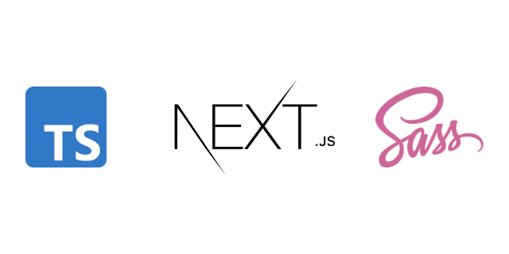

<div style="text-align:center"></div>

# next js template

This repository is a template to what I mostly used, for building a website using next js. you can check out the template [here](https://hello-world-chi-fawn.vercel.app/ "Template website").

<br>

# Getting started

<br>

## Instalation

To download this repository simply run

```bash
git clone https://github.com/ShapeShapa/next-js-typescript-scss-prettier-eslint-template.git
```

and then install the necessary packages.

```zsh
# if you use yarn
yarn install

# if you use npm
npm install
```

## running the code

to run the code simply run

```zsh
yarn dev

# or

npm run dev
```

and then go to your browser, and go to [localhost:3000](http://localhost:3000/).

# Licence

MIT
